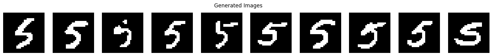
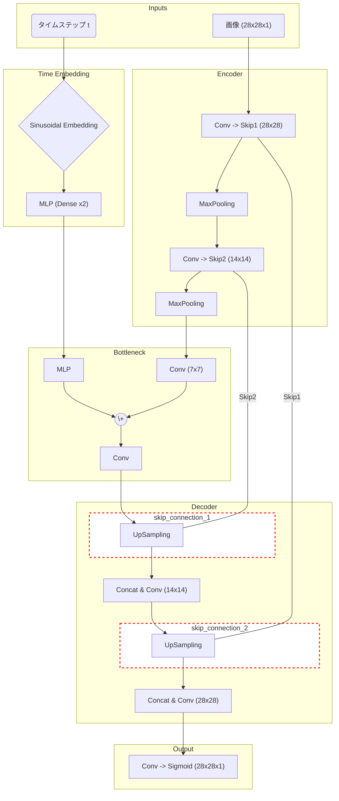

# MNIST Diffusion

### 概要

このプロジェクトは、手書き数字データセット MNIST のうち、数字「5」の画像に特化して学習を行う拡散モデルの実装です。一般的な拡散モデルがガウシアンノイズを用いるのに対し、この実装では画像を0か1の二値に変換し、 **ピクセルの値をランダムに反転させる** ことでノイズを表現している点が特徴です。

モデルの動作は、以下の2つのプロセスから構成されます。

1.   **順拡散プロセス (Forward Process)** : 元の画像に少しずつノイズ（ピクセル反転）を加えていき、最終的に完全なランダムノイズ画像に変換します。このプロセスは確率的に定義され、学習時に利用されます。
2.   **逆拡散プロセス (Backward Process)** : 学習済みのU-Netモデルを使い、ランダムノイズ画像から段階的にノイズ（反転したピクセル）を取り除いて、元の画像を復元します。このプロセスによって、新しい手書き数字画像を生成します。

学習には、残差ブロックやGroupNormalizationを取り入れた改善版のU-Netモデル (`create_improved_diffusion_unet`) が使用されます。

以下に生成された画像の例を示します。

---

## 訓練（訓練アルゴリズム）

このモデルの訓練は、元の画像に特定の時間ステップ $t$ のノイズを加えたものを用意し、モデルがそのノイズ（どのピクセルが反転したか）を予測できるように学習を進めます。具体的なアルゴリズムは以下の通りです。

1.  **Repeat**  for a number of epochs:
2.  &nbsp;&nbsp;&nbsp;&nbsp;データセットから元の画像のミニバッチ $X_0$ をサンプリングする。
3.  &nbsp;&nbsp;&nbsp;&nbsp;時間ステップ $t$ を $\{1, ..., T\}$ からランダムにサンプリングする。
4.  &nbsp;&nbsp;&nbsp;&nbsp;$X_0$ から直接、時間 $t$ におけるノイズ付き画像 $X_t$ を生成する。
    * これは、あらかじめ定義された累積反転確率 `forward_flip_cumprod` に基づいて、元の画像の各ピクセルを反転させることで行われる (`X_fliped = X_batch ^ flip`)。
5.  &nbsp;&nbsp;&nbsp;&nbsp;ノイズ付き画像 $X_t$ と時間 $t$ をU-Netモデルに入力し、各ピクセルが反転した確率 $\hat{p}_\theta(X_t, t)$ を予測する。
6.  &nbsp;&nbsp;&nbsp;&nbsp; **損失を計算する** : 実際に反転したピクセル (`flip`) とモデルが予測した反転確率 (`flip_proba_predicted`) との間で、バイナリクロスエントロピー損失を計算する。
7.  &nbsp;&nbsp;&nbsp;&nbsp;勾配降下法（Adamオプティマイザ）を用いて、損失が最小になるようにモデルのパラメータ $\theta$ を更新する。
8.   **Until**  convergence.

#### 必要な変数

訓練に使用される主要なハイパーパラメータは以下の通りです。

*  **エポック数 (`n_epochs`)** : 5000
*  **学習率 (`learning_rate`)** : 0.001
*  **バッチサイズ (`batch_size`)** : 128
*  **総時間ステップ数 (`time_step`)** : 100
*  **順方向の反転確率 (`forward_flip_proba`)** : 0.005から0.02まで線形に増加するスケジュール
*  **オプティマイザ** : Adam

---

## 逆拡散プロセス（サンプリングアルゴリズム）

学習済みモデルを用いて新しい画像を生成するプロセスです。完全なノイズから開始し、時間を遡るように少しずつノイズを除去していきます。

1.   **Start**  with a random binary image $X_T$ (各ピクセルが0か1のランダムな画像)。
2.   **For**  $t = T-1, T-2, ..., 0$:
3.  &nbsp;&nbsp;&nbsp;&nbsp;現在の画像 $X_t$ と時間ステップ $t$ を学習済みU-Netモデルに入力し、各ピクセルが反転した確率 $\hat{p}_\theta(X_t, t)$ を予測する。
4.  &nbsp;&nbsp;&nbsp;&nbsp;予測された確率に基づき、反転させるピクセル `flip` を決定する。
5.  &nbsp;&nbsp;&nbsp;&nbsp;現在の画像と `flip` のXOR（排他的論理和）をとることで、一つ前のステップの画像 $X_{t-1}$ を計算する (`X = X ^ flip`)。
6.   **End For** 
7.   **Return**  a final generated image $X_0$。

---

## 予測モデル

U-Net を参考にした、簡易的なモデルです。

U-Netは、その構造がアルファベットの「U」の字に似ていることから名付けられました。主な役割は、 **入力画像に含まれるノイズを予測・除去し、元の画像を復元する** ことです。

### モデルの全体像 (Mermaid記法)

モデル全体のデータの流れをMermaid記法で示すと、以下のようになります。U字型の構造と、エンコーダーからデコーダーへ情報を直接渡す「スキップ接続」が特徴です。

### 各部分の役割

#### 1. 入力層
このモデルは2つの情報を受け取ります。
-  **画像 (`image_input`)** : ノイズが加えられた28x28ピクセルのグレースケール画像。
-  **タイムステップ (`time_input`)** : 拡散プロセスのどの時点（どれくらいノイズが乗っているか）かを示す整数 `t`。

#### 2. 時間埋め込み (Time Embedding)
- タイムステップ（ただの数字）を、ニューラルネットワークが扱いやすい固定長のベクトルに変換します。
- `SinusoidalPositionalEmbedding` を使い、時間 `t` の情報を波（サイン波）の組み合わせで表現します。
- その後、MLP（全結合層）を通して、より複雑な特徴量に変換します。

#### 3. エンコーダー（収縮パス）
- U-Netの左側にあたる部分です。
- `Conv2D`（畳み込み層）と`MaxPooling2D`（プーリング層）を繰り返し、画像の特徴を抽出しながら、解像度を下げていきます (28x28 → 14x14 → 7x7)。
- 解像度を下げる前に、一部の特徴マップを **スキップ接続 (`skip1`, `skip2`)**  として保存しておきます。これは後でデコーダーが綺麗な画像を復元するための重要な「ヒント」になります。

#### 4. ボトルネック
- U-Netの底の部分で、モデルの中で最も解像度が低い部分です。
- ここで、 **時間埋め込みベクトルが画像の特徴マップに注入されます** 。
- `Add` レイヤーを使って、画像情報と時間情報を足し合わせることで、「この時間ステップでは、このような特徴を持つ画像からノイズを取り除く」という文脈をモデルに与えます。

#### 5. デコーダー（拡張パス）
- U-Netの右側にあたる部分です。
- `UpSampling2D` を使って、特徴マップの解像度を上げていき、元の画像サイズに戻していきます (7x7 → 14x14 → 28x28)。
- 各段階で、エンコーダーで保存しておいた **スキップ接続の情報を `Concatenate` で結合** します。これにより、エンコーダーで失われた詳細な位置情報が復元され、出力がぼやけるのを防ぎます。

#### 6. 出力層
- 最終的に `Conv2D` を通して、チャネル数を1（グレースケール）に戻します。
- `sigmoid` 活性化関数により、出力値が 0 から 1 の範囲に収められます。これは、予測するノイズ（または画像そのもの）のピクセル値を正規化していることを意味します。
